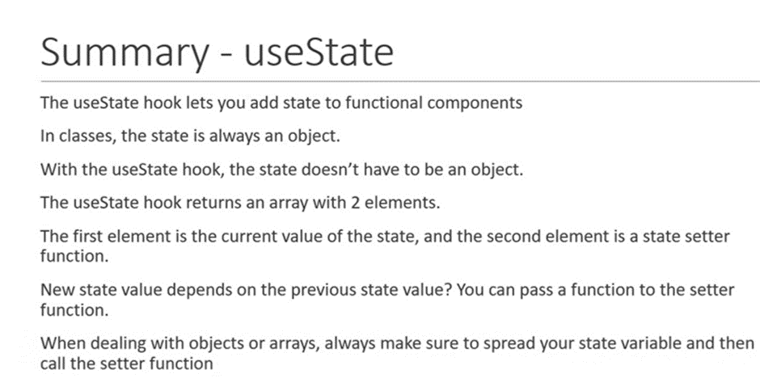
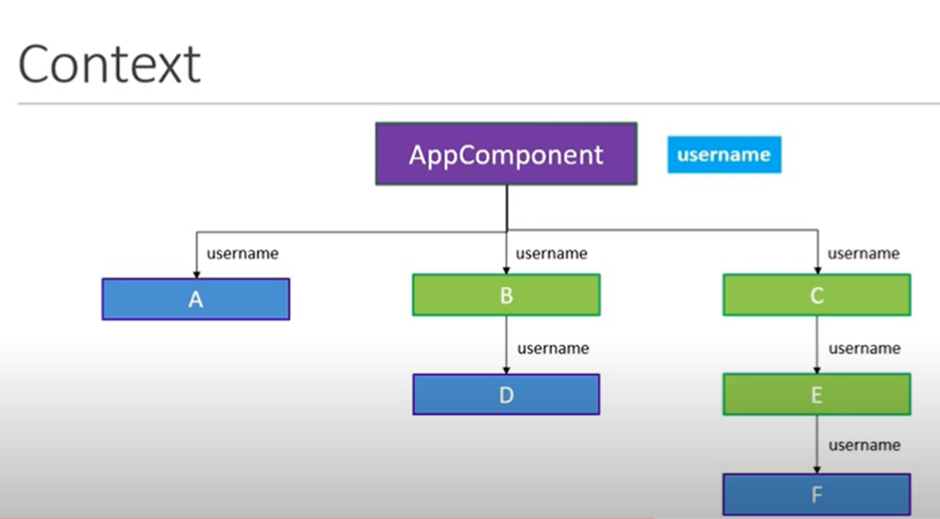
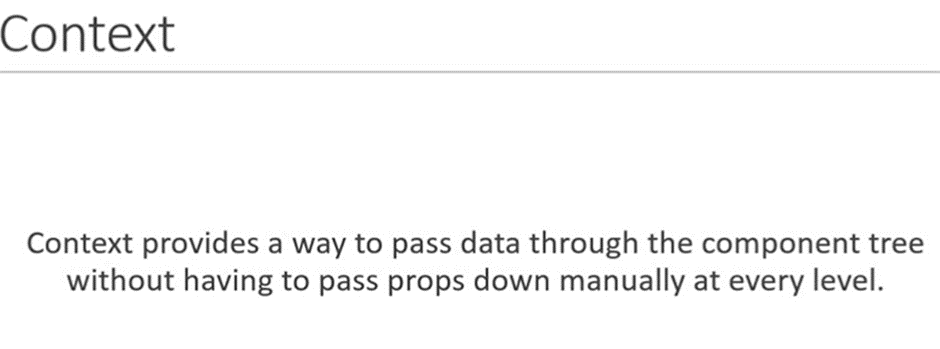

## State Management/ propogating change - React Hooks
React gets it name as it reacts in changing the state of components and when there are changes it re renders the JSX in return statement. 

In a React application, state refers to the data that represents the current condition or values of a component. It allows React components to keep track of and manage dynamic information, such as user input, API responses, or changes in the component’s internal state. Here are some key points about state in React:
1.	Definition: State is a JavaScript object that contains real-time data or information related to a component. It allows to manage changing data within your application.
2.	Local to Components: State is local to the component where it is defined. Unlike props, which are passed from parent components and are immutable, state can be changed within the component itself.
3.	Dynamic Data: You can use state to handle data that may change over time, such as user interactions, form inputs, or API responses.
4.	Reactivity: When the state of a component changes, React automatically re-renders the component to reflect the updated data.

Hook: A hook is just a special function that let you hook into react features. 

### Use State Hook
The state of our application is bound to change at some point. This could be the value of a variable, an object, or whatever type of data exists in our component.
To make it possible and to have the changes reflected in the DOM, we have to use a React hook called useState. 
we will import react hook “Use state” in Content Component , so that we can use Use state hook Inside component.

### Usestate Hook:
With Rfce in div add button as a part of JSX we will add a button and on button put on click handler “onClick = { }” also count as a inner text.

Three steps necessary to implement the counter:
1.	Step one is to create a functional component, we have created a functional component with “rfce”.
2.	Step two is we need a state property initialized to zero.
3.	Step three is we need a method that is capable of setting that state property value. (count variable)

To implement step 2 and 3 we need a usestate hook. So usestate is a hook that let us add react state to functional component.
We begin with importing use state from react, now how do we use it in our component.
Hooks are functions, so we simply call them.
useState (), function or hook accepts an argument which is initial value of state property and returns the current value of state property and a method that is capable of updating that state property.

                                          Const [count, useCount] = useState(0 ) 

			                             Return part of hook               useState function with initial value of zero
			                        Syntax here is array destructuring 
		                                Which is feature in ES6

With this we have our step two and three implemented. We can now use these variables in JSX.
<button> onClick = {setCount(count +1)}> Count {count} </button>
 
This becomes a function call lets convert it into arrow function.

Rules of Hooks:
•	Only call hooks at the top level
•	Don’t call hooks inside loops, conditions, or nested functions.
•	Only call hooks from react functions
•	Call them from within react functional component and not just any regular javascript function

Examples:
Usestate with Previous state:
Usestate with Objects:
Usestate with Arrays:

Using Object as a Variable with use state hook.
Usestate does not automatically merges the document , we have to manually merge the values of object using spread operator

## UseEffect - Hook:
The useEffect hooks let us perform side effects in functional components.
Make a simple counter with useState hook first, we want to change the document title of page on button click and will achieve it using effect hook, import use effect it is also a function and simply call it and pass it a parameter which is a function and get executed after every render of the component , put an arrow function which updates the doc title , so when we click we can see the side effect as counter updates and doc title updates as well.
When we specify useEffect we are basically requesting react to execute the function that is passed as an argument every time the component renders 
1.	Use effect runs after every single render. 
2.	Use effect is placed inside react component and with that we can easily access state and props without writing an additional function.

### Case2: in some cases, applying the useEffect after every render might create a performance problem, so we need a way to conditionally run an effect from a functional component.
It is updating title if it is not even changing between renders, so how do we tell react to conditionally render only when the count value changes 
For conditionally executing an effect we are passing a second parameter this parameter is an array, within this array we need to specify either props or state we need to watch for , only if those props in states specified in this array were to change the effect would be executed and in our case we need affect to be executed only when count value changes.

Run Effects only Once:
We will create two state variables x and y initialized to zero and in JSX we will render these state variables “ Hooks X – {x}  Y – {y}  , now we add an event listner or the mouse event and this is were we use effect hook, we want effect to render once only , and we specify by simply putting an empty array to useEffect, means we are telling react that this particular prop does not need on any prop or state so there is no reason to call this effect on rerenders. 

useEffect with Cleanup:
with same Hook mouse we made a component and add button that will toggle buttons visibility, new file mouse container.js, with rfce create f.component and use state we use getter display and setter is setDislay  and initial value to true. In JSX we’ll add a button that will toggle btw true and false and added an event listener. Now in HookMouse File we add a return in effect function and add a function remove event listner. 

## UseContex -Hook
Context API

Component A, D and F suppose to display the logged in user name, that info is maintained as a property in the app component, so be able to display user name in nested components we need to pass down user name as a prop.

There are three steps to implement when using context, means directly passing data from app to component F
1.	Step one is to create a context, that will be created in app component 
2.	Step two is to create a user Context Provider and passing component c as a Child and setting a value with property.
3.	Third step is to consume the context value, import useContext hook in component E, also import userContext and ChannelContext from app. Then simply pass Usecontext hook in function and pass UserContext and ChannelContext as an argument and store in a variable, return in JSX {user} – {channel} and it is simple as it could be.

import React from 'react'
import { useState } from 'react';

const Content = () => {
    const [name, setName] = useState('Dave');
    const [count, setCount] = useState(0);

    const handleNameChange = () => {
        const name = ['bob', 'cave' , "davin"];
        const int = Math.floor(Math.random() * 3); 
        setName(names[int]); 
      }

const handleClick = () => {
    setCount(count + 1)
    console.log(count);
}
const handleClick2 = () => {
    console.log(count);
}

  return (
    <main>
        

            Hello {name}!
        

        <button onClick={handleNameChange}>Change Name </button>
         
        <button onClick={handleClick}>Click It</button>
         
        <button onClick={handleClick2}>Click It</button>
    </main>
  )
}

export default Content

* Const [name, setName] this is array destructuring which we get from use State, Name will provide with any given value in time, name as Getter and setName as setter. 
* Now we can change the handle event change in JSX by name, this will only give us current state. In handleNamechange Function we replace return with SetName and pass(names[int].
So we have to change our handleNameChange Function, we use const here as we never want to reassign value here directly and use NameState. 
* Now another UseState added count as log in handle click and in JSX, we will replace Click 2 Button with handle Click. When we click 2nd button it should called handle click and what should happen the count variable / or Count State will be logged to the console as a value of current state. Let change in HandleClick Function add change state SetCount (Count+1) we still got 0 as even we set the count to Count + 1. Value of default count was 0 and still 0 in the console even if we copy +1 line, that is not really it works.
Current Value of state comes into the function and we do not alter that.

